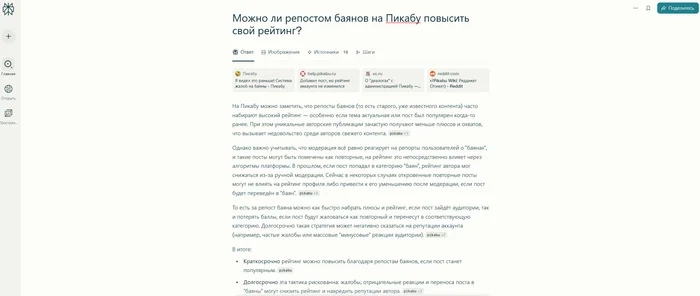
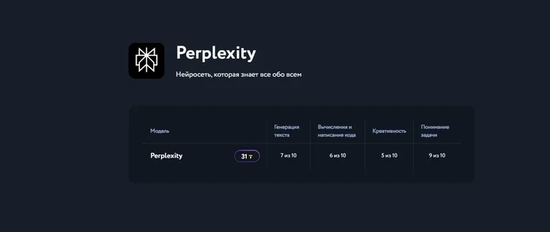

# Perplexity AI: What It Is, How to Use It, and Why You Actually Need It

---

So you've been hearing about Perplexity AI everywhere lately. Some folks call it the "Google killer," others compare it to ChatGPT, and everyone seems to be asking how to actually get their hands on it. Fair question. Let's break down what this thing does, why people are excited about it, and whether it's worth your time—no fancy jargon, just straight talk.

---

## What Perplexity AI Actually Is (In Plain English)

Think of Perplexity as what would happen if a search engine and a really smart research assistant had a baby. Instead of throwing a bunch of blue links at you like Google does, Perplexity reads through dozens of sources and gives you one coherent answer. With citations.

It's not just regurgitating facts either. The AI can reason, compare information, draw conclusions—basically do the heavy lifting you'd normally spend hours on. Whether you're a student trying to understand quantum physics, a journalist fact-checking a story, or just someone who wants to know the best router for their apartment, Perplexity handles it.

Here's where it shines:

- **School and research** — Get complex topics explained like you're talking to a patient friend, not reading a textbook
- **Content work** — Journalists and bloggers use it to gather facts, verify data, find fresh angles
- **Business stuff** — Market research, competitor analysis, testing hypotheses without drowning in tabs
- **Coding** — Find code examples, understand algorithms, debug faster
- **Legal questions** — Quick breakdowns of laws and precedents (though always verify with a real lawyer)
- **Medical info** — Pull up recent studies and research (again, not a substitute for actual medical advice)
- **Everyday life** — "Where should I travel?" "How do I cook pasta without cream?" "What's the deal with this new phone?"

The key difference from traditional search? Perplexity doesn't just find information—it understands what you're actually asking and synthesizes an answer.

## What Makes Perplexity Different (And Better at Some Things)

Here's what this AI can do that makes it worth paying attention to:

1. Answer complex questions by pulling from multiple reliable sources
2. Give you detailed explanations formatted like actual guides
3. Create lists, step-by-step instructions, comparisons
4. Summarize long documents or articles in seconds
5. Work with scientific papers, technical specs, legal documents
6. Access current information (it's connected to the internet, unlike base ChatGPT)

The real magic is that Perplexity closes the gap between "finding an answer" and "understanding it." ChatGPT is brilliant at generating content, but its knowledge has a cutoff date. Perplexity is always current.

Using it is dead simple:
1. Go to the website or open the app
2. Type your question in English or Russian
3. Get a structured answer with sources

For unlimited access and advanced features, you'll want **Perplexity Pro**. It unlocks:

- Access to GPT-4 and Claude models
- No query limits
- File uploads and document analysis
- Custom AI assistants for specific tasks
- Priority responses with better accuracy

Think of Pro as upgrading from a smart search engine to a full-blown research assistant that works 24/7.

## The Russian Language Situation

Good news: Perplexity understands Russian perfectly. You can ask questions in Russian and get answers in Russian. The interface is in English, but the AI automatically adapts to whatever language you're using.

For those wondering how to get Perplexity working in Russian—it already does. Just type your question in Russian and you're set.

## The Payment Problem (And How to Actually Get It)

Here's where things get annoying. Official pricing is:

- **Pro** — $20/month
- **Pro Annual** — $200/year (saves you about 20%)

But if you're in Russia, you can't pay directly. The system doesn't accept Russian cards. People try workarounds—foreign cards, VPNs, crypto payments—but it's messy and risky.

👉 [Skip the payment headaches and access Perplexity directly through services that work with Russian cards](https://pplx.ai/ixkwood69619635)—no VPN gymnastics required.

## Perplexity vs. ChatGPT: Which One Do You Need?

They're good at different things:

- **ChatGPT** — Brilliant for writing, creativity, generating content, brainstorming. But its knowledge is frozen at its training cutoff.
- **Perplexity** — Connected to the live internet, always current, better for research and fact-finding.

Think of ChatGPT as your creative writer friend and Perplexity as your researcher friend. Together, they cover almost everything you'd need.

## FAQ: The Questions Everyone Actually Asks

**What makes Perplexity different from regular search engines?**  
Instead of showing you a list of links, Perplexity reads through sources and gives you one coherent answer with citations. It's like having someone do the research for you and summarize the findings.

**Does it work in Russian?**  
Yes. It understands Russian queries and responds in Russian. The interface is English, but the AI adapts automatically.

**What do you get with Perplexity Pro?**  
Unlimited queries, access to better AI models (GPT-4, Claude), file uploads, document analysis, and custom assistants. The free version is fine for testing, but Pro is where it becomes genuinely useful for professional work.

**Can you buy it directly in Russia?**  
Not easily. The official site doesn't accept Russian payment methods. Most people either use workarounds or access it through intermediary services that handle the payment complexity.

**Is the information reliable?**  
Perplexity always cites sources, which reduces the risk of AI "hallucinations." But for critical stuff—medical, legal, financial—always verify with an expert. Use it as a research filter, not the final word.

**How is it better than ChatGPT?**  
ChatGPT is better for writing and creativity. Perplexity is better for research and current information. They complement each other rather than compete.

**Can students use it for studying?**  
Absolutely. It explains complex topics clearly, finds academic papers, creates summaries. Many students use it for exam prep and research. Just remember—it helps you learn faster, but it's not a substitute for actually learning.

**Do you need a VPN?**  
The Perplexity website works in Russia without restrictions. The problem is payment, not access. 👉 [Services that provide direct access solve this without requiring VPN setup](https://pplx.ai/ixkwood69619635).

**Can it analyze documents?**  
Yes, in Pro. Upload PDFs and it'll extract key data, summarize content, explain structure. Useful for legal docs, reports, research papers.

**What's the difference between Pro and Pro Annual?**  
Just the payment schedule. Pro is $20/month, Annual is $200/year (about 17% savings). Same features either way.

**Is it worth the money?**  
For people who do research regularly—journalists, students, entrepreneurs, analysts—it pays for itself quickly by saving hours of work. For occasional use, the free version might be enough.

---

## Bottom Line

Perplexity AI represents a genuine shift in how we find and process information. It's not just another chatbot—it's a research tool that actually understands what you're looking for and delivers answers that make sense. For anyone who spends time digging through search results, reading multiple articles to piece together an answer, or trying to stay current with their field, Perplexity solves a real problem. The access situation for Russian users is annoying, but workable through services designed specifically for that purpose. Whether you need it depends on how much you value your time—and how tired you are of wading through search results to find what you actually wanted to know.
